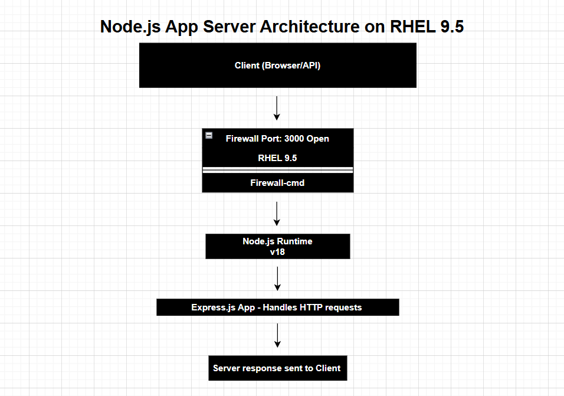
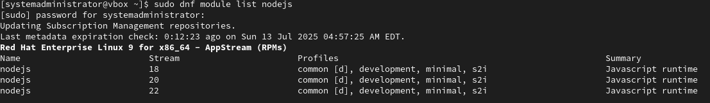
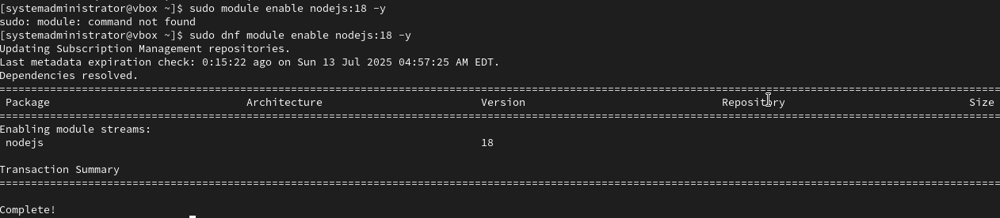
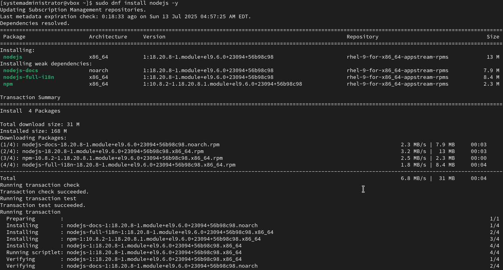
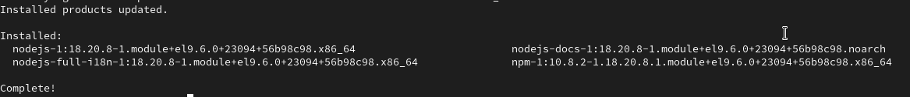
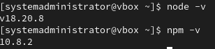
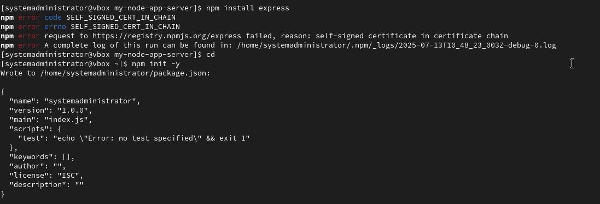
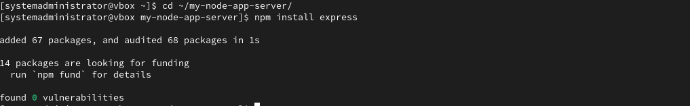

# Building App-Server-using-Node.js in RHEL 9.5

## 1. Update the System
```
sudo dnf update -y

#dnf: The default package manager in RHEL 9+ versions

#update: Updates all installed packages to the latest available version.

#-y: Automatically answers "yes" to all prompts.
```


## 2. Enable and Install Node.js
```
sudo dnf module list nodejs

#Lists all available streams (versions) of Node.js
```


```
sudo dnf module enable nodejs:18 -y

#module enable: Activates a specific version stream of Node.js (version 18 here).

#-y: Confirms the enablement.
```


```
sudo dnf install nodejs -y

#Installs Node.js and its package manager
```



```
node -v
npm - v 

#Verifies installation by printing the installed versions of Node.js and npm.
```


## 3. Create a Project Directory 

```
mkdir ~/my-node-app-server
cd ~/my-node-app-server

#mkdir: Creates a new directory called my-node-app in your home directory.

#cd: Changes into that directory.
```
## 4. Initialze the project 

```
npm init -y 

#Creates a package.json file with default values.
```
```
npm install express

#Downloads and installs express, a lightweight web framework for Node.js.

#Adds it to your dependencies in package.json.

Note: you may get an error because the system might be blocking the connection to the npm registry due to SSL Certificate Issue. 
```


- Temporarily Disable Strict SSL
```
npm config set strict-ssl false

#then Retry; 
npm install express
```
You should not be able to see the following output:


## Create the App Server File 

```
nano appserver.js

inside appserver.js
const express = require('express'); // Loads Express module
const app = express();              // Creates an Express app
const PORT = 3000;                  // Defines the port

app.get('/', (req, res) => {
  res.send('RHEL 9.5 Node.js App Server!');
}); // App Server Responds "/"

app.listen(PORT, () => {
  console.log(`App Server is running on http://localhost:${PORT}`);
}); // Starts the server and listens on the defined port
```